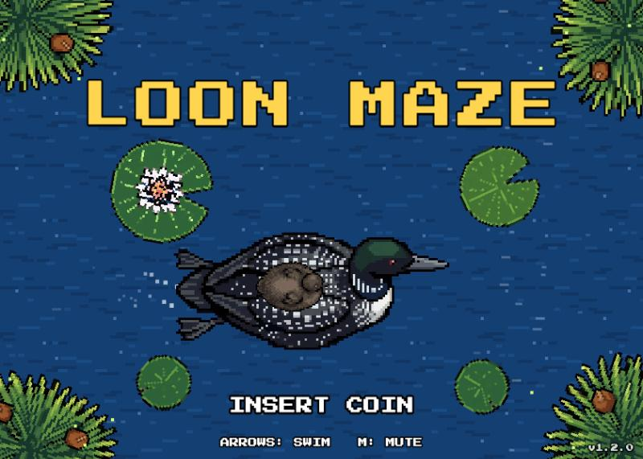
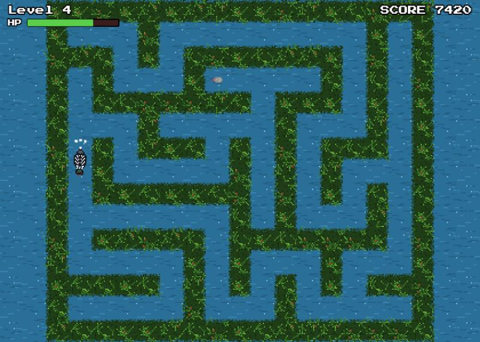
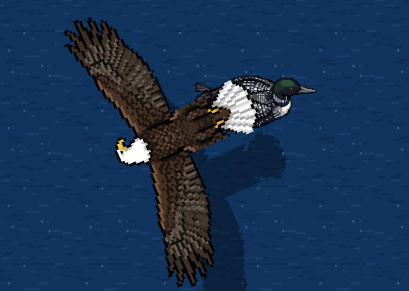

# Loon Maze

Guide a loon through a maze of reeds to reunite with its chick, before the bald eagle gets it. A pixel-art browser game for desktop and phones.



<p>
  
  
</p>

## How to play

- **Find the chick.** Each level is a new, randomly generated maze, and each one is a little bigger than the last. Big mazes scroll as you swim.
- **Mind the reeds.** Swimming hard into a reed wall costs HP. Gentle bumps are free. Your HP carries from level to level, and every reunion heals a little. Run out, and the eagle swoops in.
- **Swim like a loon.** The loon speeds up, glides when you let go, curves through turns, bounces off the reeds and drifts with the current.
- **Score big.** Each level earns 1000 × the level number, plus a speed bonus for finishing fast. The top 10 scores go on the high score table with your initials, arcade style.

## Controls

| | Keyboard | Touch |
|---|---|---|
| Swim | Arrow keys | Drag anywhere on the screen; drag further to paddle harder |
| Start / continue | Enter | Tap |
| Mute | M | "SOUND" button |

## Run it locally

You'll need [Node.js](https://nodejs.org/) 20.19 or later.

```bash
npm install
npm run dev
```

Then open http://localhost:5173. To try it on a phone on the same Wi-Fi, run `npm run dev:phone` and open the "Network" address it prints. Hold the phone sideways. For full screen with no browser bars, add it to your home screen: in Safari, tap **Share**, then **Add to Home Screen**; in Chrome, tap **⋮**, then **Add to Home screen**.

`npm run build` makes a production build in `dist/` that you can host on any web server. It uses relative paths, so it works from a subfolder too.

## How it's made

- **Engine:** [Phaser 4](https://phaser.io/) and [Vite](https://vite.dev/), in plain JavaScript.
- **Art:**
  - The big title and cutscene sprites (loon, chick, eagle, reeds, lily pads) were generated with Google's Gemini image model. `tools/pixelize.py` converted them into clean pixel art; the originals are in `art-source/`.
  - The small in-game sprites are hand-drawn as character grids in `src/art/pixelArt.js`.
  - The reed walls and water are generated in code.
- **Sound:** all music and sound effects are synthesized in the browser with the Web Audio API. There are no audio files.
- **Font:** [Press Start 2P](https://fonts.google.com/specimen/Press+Start+2P) by CodeMan38, under the SIL Open Font License.

See [CHANGELOG.md](CHANGELOG.md) for what's new in each version.

## License

[MIT](LICENSE) © 2026 David Rosen
