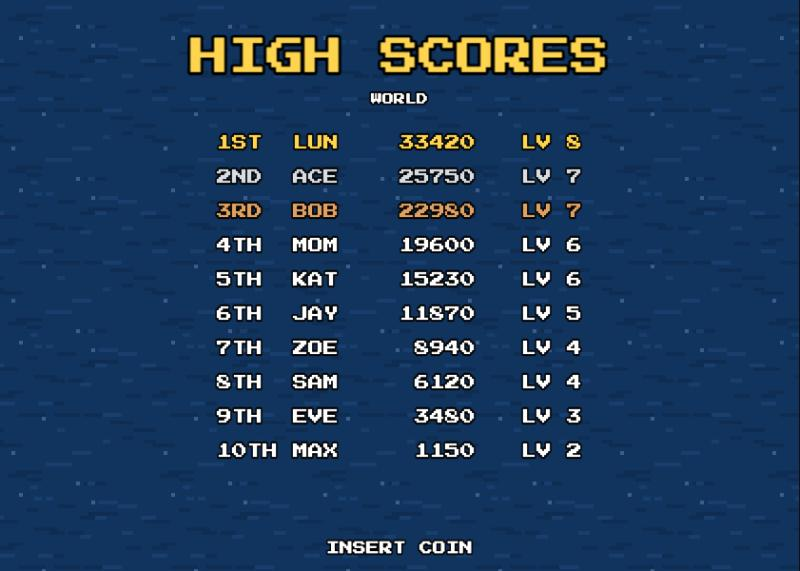

# Loon Maze

Guide a loon through a maze of reeds to reunite with its chick, before the bald eagle gets it. A pixel-art browser game for desktop and phones.


<p>
  
  
</p>

## How to play

- **Find the chick.** Each level is a new, randomly generated maze, and each one is a little bigger than the last. Big mazes scroll as you swim.
- **Mind the reeds.** Swimming hard into a reed wall costs HP. Gentle bumps are free. Your HP carries from level to level, and every reunion heals a little. Run out, and the eagle swoops in.
- **Dive under the reeds.** From level 6 on, the loon can dive and swim under the reed walls, after a short lesson. You get one dive per level at first, and an extra one at levels 11, 16 and 21. Each dive is a single short breath, and running out under the reeds costs HP.
- **Swim like a loon.** The loon speeds up, glides when you let go, curves through turns, bounces off the reeds and drifts with the current.
- **Catch fish.** From level 2, fish dart around the maze. Catch them for points, and golden ones heal. Later, big air bubbles hidden in dead ends give an extra dive.
- **Score big.** Each level earns 1000 × the level number, plus a speed bonus for finishing fast, and up to three stars. The top 10 scores go on the high score table with your initials, arcade style. If the game is hosted with its score server, that's a **world** table shared by everyone who plays there; otherwise it's kept on your device.

## Controls

| | Keyboard | Touch |
|---|---|---|
| Swim | Arrow keys | Drag anywhere on the screen; drag further to paddle harder |
| Dive (from level 6) | Hold Space | Hold the "DIVE" button |
| Start / continue | Enter | Tap |
| Mute | M | "SOUND" button |

## Run it locally

You'll need [Node.js](https://nodejs.org/) 20.19 or later.

```bash
npm install
npm run dev
```

Then open http://localhost:5173. To try it on a phone on the same Wi-Fi, run `npm run dev:phone` and open the "Network" address it prints. Hold the phone sideways. For full screen with no browser bars, add it to your home screen: in Safari, tap **Share**, then **Add to Home Screen**; in Chrome, tap **⋮**, then **Add to Home screen**.

`npm run build` makes a production build in `dist/` that you can host on any web server. It uses relative paths, so it works from a subfolder too.

## World high scores (optional)



Out of the box, high scores are saved in the browser, so each device has its own table. To share one table among everyone who plays your copy, run the included score server next to the game:

```bash
npm run scores-server
```

It's a small Node server with no dependencies. It listens on `127.0.0.1:3010` and keeps the top 10 in `data/scores.json` (set `PORT`, `HOST` or `DATA_DIR` to change these). It checks every entry: initials must be three letters or digits and not rude, the score must be possible for the level reached, and each visitor can only submit a few times every 10 minutes.

The game asks for scores at `api/scores` on its own site, so pass that path to the server from your web server. There's an nginx example in [`server/nginx-api.conf`](server/nginx-api.conf) and a systemd unit in [`server/loon-maze-scores.service`](server/loon-maze-scores.service). While developing, `npm run dev` already passes `/api` to a local score server. The high score screen shows **WORLD** when it's using the shared table, and **THIS DEVICE** when the server can't be reached.

`npm run deploy` (in `scripts/deploy.sh`) is the script I use to deploy the game and score server to my own server over SSH. Change the host and paths in it to match yours.

## How it's made

- **Engine:** [Phaser 4](https://phaser.io/) and [Vite](https://vite.dev/), in plain JavaScript.
- **Art:**
  - The big title and cutscene sprites (loon, chick, eagle, reeds, lily pads) were generated with Google's Gemini image model. `tools/pixelize.py` converted them into clean pixel art; the originals are in `art-source/`.
  - The small in-game sprites are hand-drawn as character grids in `src/art/pixelArt.js`.
  - The reed walls and water are generated in code.
- **Sound:** all music and sound effects are synthesized in the browser with the Web Audio API. There are no audio files.
- **Font:** [Press Start 2P](https://fonts.google.com/specimen/Press+Start+2P) by CodeMan38, under the SIL Open Font License.

See [CHANGELOG.md](CHANGELOG.md) for what's new in each version.

## License

[MIT](LICENSE) © 2026 David Rosen
